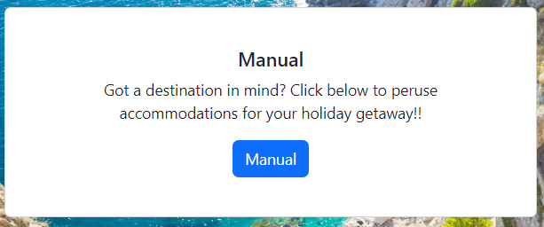
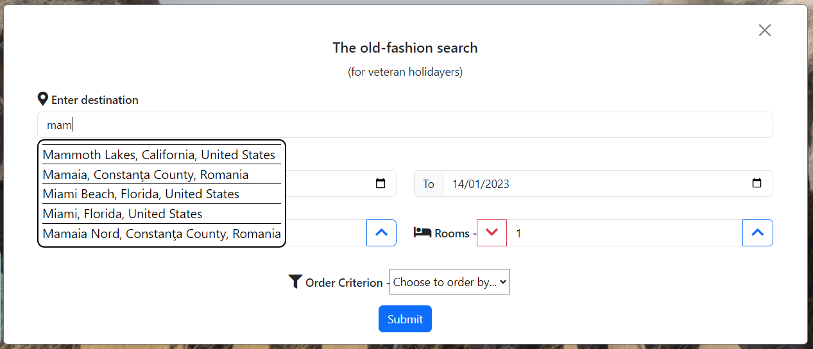
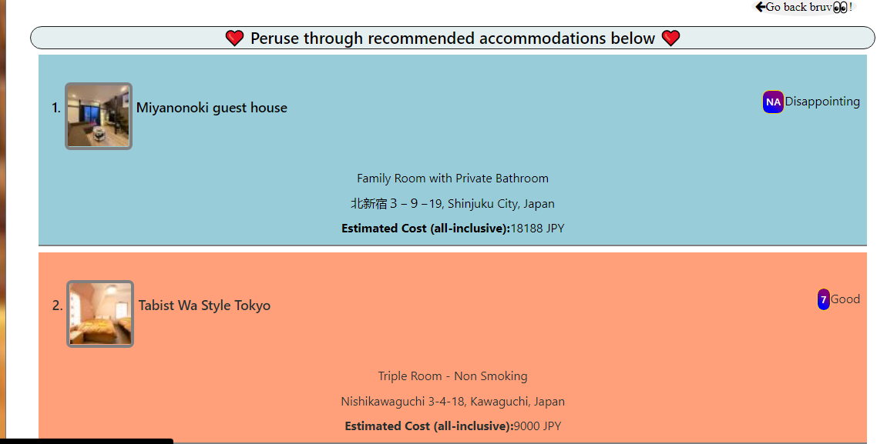
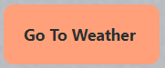
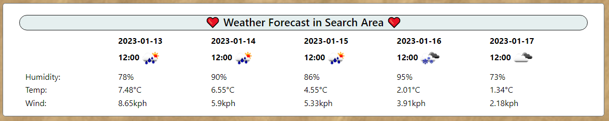
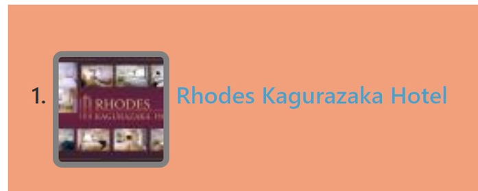
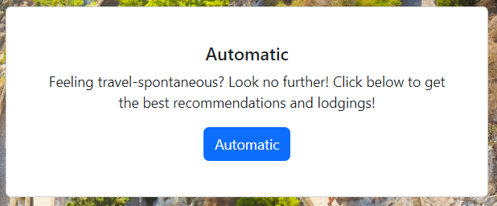
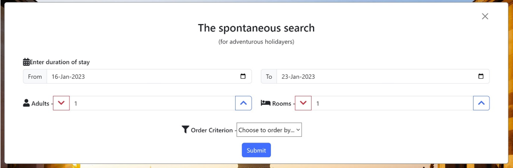
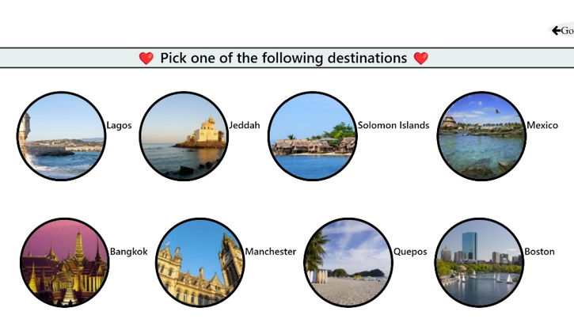

# hodophile

This is a user-friendly website that allows users to search known holiday destinations and access information on hotels in the area as well as weather conditions in the holiday destination.

This is the height of life!!!
Enjoy Every moment!!
Feel the Joy!!
❤️❤️

## Installation
Visit our live website [here](https://enwokedi96.github.io/hodophile/).

## Usage

Οur website provides the possibility to search accommodations for holiday destinations the user wants to visit and also recommend possible holiday places.

* Search with the manual option.
This option will give you the ability to search the places you want to visit. 
First, click the "manual" button.

Then start typing your destination and allow our system pull out suggestions to aid your search. Simply click on the desired destination, fill the rest of the form and click Submit. 

The next page will present lodging recommendations suited to your needs, alongside addresses, ratings and estimated cost for duration of stay. 

The user can also preview the weather forecast at your destination while you wait, or view again by clicking 
 button. 

To book a place, click on your choice to get redirected to the specific accommodation on booking.com. Users can also click on the name of the lodge to automatically Google the hotel and get more info.

* Search with the automatic option.
Feeling spontaneous? This option will randomly search out all-time favorite all around the world. To get started, click "Automatic" button on our homepage.

Simply fill out the form and submit. 

Our system will then recommend anywhere between 6 - 8 destinations world over.

Not liking any of the recommendations? You can refresh  the search and get new ones 

